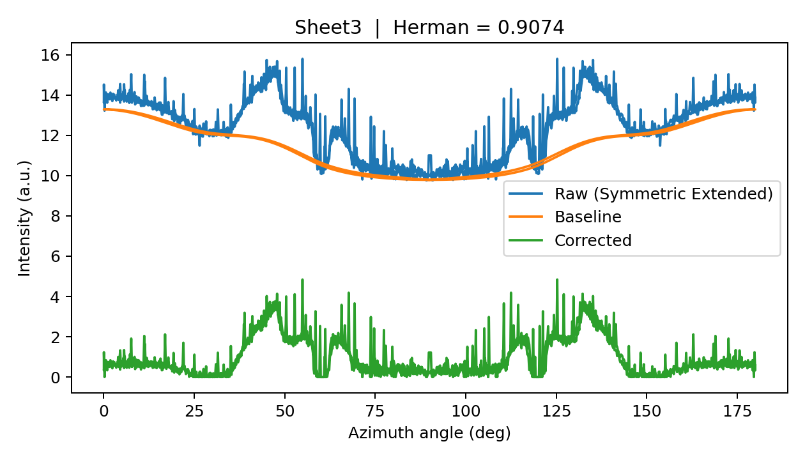

# WAXS-Herman-Analysis

Python toolkit for WAXS azimuthal profile processing and Herman orientation factor calculation.

## Associated Publication

This repository contains the data-processing workflow used for WAXS orientation analysis in the following publication:

**Shear-aligned zeolite lamellae enable directional ion transport for durable solid polymer electrolytes**

Chinese Chemical Letters (2026)

DOI: https://doi.org/10.1016/j.cclet.2026.112760

---

## Overview

The workflow includes:

- Azimuthal profile extraction
- Symmetric profile extension
- Baseline correction (AsLS)
- Herman orientation factor calculation
- Visualization of raw, baseline and corrected profiles
- Result export to CSV

---

## Example Result

The figure below shows a typical WAXS azimuthal profile processing workflow.



The blue curve represents the raw symmetric intensity profile, the orange curve corresponds to the fitted baseline, and the green curve is the baseline-corrected signal used for Herman orientation factor calculation.

---

## Repository Structure

```text
WAXS-Herman-Analysis
│
├── example_data/
│   └── 251018.xlsx
│
├── example_results/
│   └── herman_results.csv
│
├── plots/
│   └── herman_example.png
│
├── src/
│   └── herman_analysis.py
│
├── requirements.txt
└── README.md
```

---

## Installation

```bash
pip install -r requirements.txt
```

## Usage

```bash
python src/herman_analysis.py
```

Input files should be placed in:

```text
example_data/
```

Results will be exported to:

```text
example_results/
```

---

## Output

The script automatically generates:

- Baseline-corrected azimuthal profiles
- Herman orientation factors
- Publication-quality figures
- CSV summary tables

## Citation

If you use this code in academic work, please cite:

```text
Yu Yuan, Runfang Zhang, Qiyuan Xue, et al.
Shear-aligned zeolite lamellae enable directional ion transport for durable solid polymer electrolytes.
Chinese Chemical Letters, 2026.
DOI: 10.1016/j.cclet.2026.112760
```

## License

MIT License
